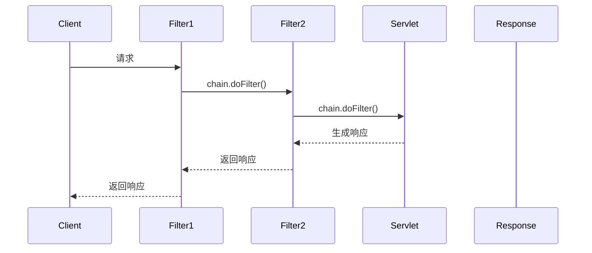
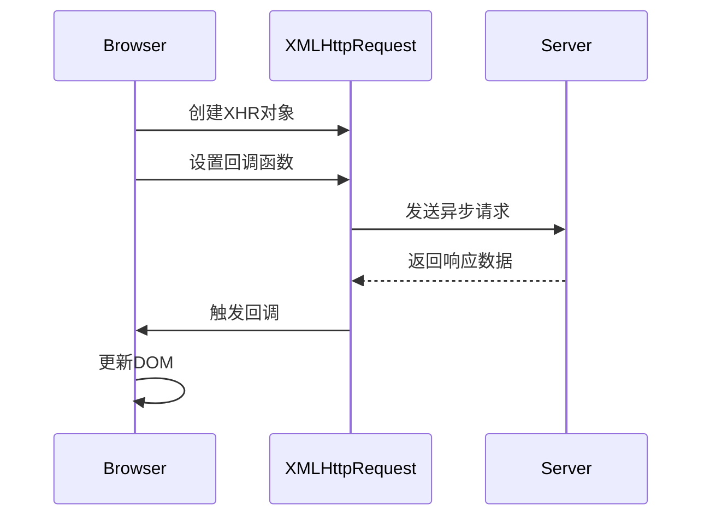
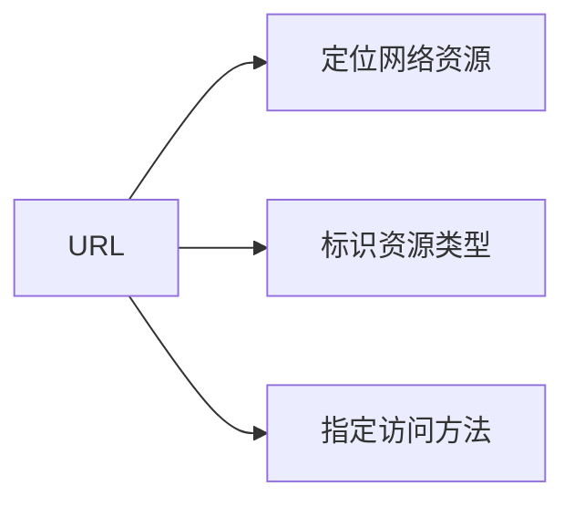

<h1 align = "center">Web A 考点整理</h1>

## 一、选择题（14×2）

### 1、HTML form标签使用

```html
<!-- form 标签开始 -->
    <form action="/register" method="post" enctype="application/x-www-form-urlencoded">
  
        <!-- 文本输入框 -->
         <!-- required表示必填 -->
        <div class="form-group">
            <label for="username">用户名:</label>
            <input type="text" id="username" name="username" required 
                   placeholder="请输入用户名" minlength="4" maxlength="20">
        </div>
  
        <!-- 密码输入框 -->
        <div class="form-group">
            <label for="password">密码:</label>
            <input type="password" id="password" name="password" required
                   placeholder="请输入密码" minlength="6">
        </div>
  
        <!-- 邮箱输入框 -->
        <div class="form-group">
            <label for="email">电子邮箱:</label>
            <input type="email" id="email" name="email" required
                   placeholder="example@domain.com">
        </div>
  
        <!-- 单选按钮 -->
        <div class="form-group">
            <label>性别:</label>
            <label><input type="radio" name="gender" value="male" checked> 男</label>
            <label><input type="radio" name="gender" value="female"> 女</label>
        </div>
  
        <!-- 下拉选择框 -->
        <div class="form-group">
            <label for="country">国家/地区:</label>
            <select id="country" name="country">
                <option value="">--请选择--</option>
                <option value="china">中国</option>
                <option value="usa">美国</option>
                <option value="uk">英国</option>
            </select>
        </div>
  
        <!-- 多选框 -->
        <div class="form-group">
            <label>兴趣爱好:</label>
            <label><input type="checkbox" name="hobbies" value="reading"> 阅读</label>
            <label><input type="checkbox" name="hobbies" value="sports"> 运动</label>
            <label><input type="checkbox" name="hobbies" value="music"> 音乐</label>
        </div>
  
        <!-- 文件上传 -->
        <div class="form-group">
            <label for="avatar">头像上传:</label>
            <input type="file" id="avatar" name="avatar" accept="image/*">
        </div>
  
        <!-- 隐藏域 -->
        <input type="hidden" name="token" value="abc123xyz">
  
        <!-- 提交按钮 -->
        <button type="submit">注册</button>
  
        <!-- 重置按钮 -->
        <button type="reset">重置</button>
    </form>
    <!-- form 标签结束 -->
```

<div style="text-align: center;">
  
</div>

- #### action属性（定义提交到哪）

  > ##### **action 属性的基本定义**
  >
  > - `action` 是 HTML `<form>` 标签的一个**必需属性**，它用于指定当用户提交表单时，表单数据应该发送到哪个服务器端程序或页面进行处理。
  >
  > ##### **action 属性的语法**
  >
  > ```html
  > <form action="URL">
  >   <!-- 表单内容 -->
  > </form>
  > ```
  >
  > ##### **action 属性的取值**
  >
  >> ###### **(1) 绝对 URL**
  >>
  >> ```html
  >> <form action="https://example.com/process-form.php">
  >> ```
  >>
  >> - 提交到其他网站的指定地址
  >> - 需要完整的协议和域名
  >>
  >> ###### **(2) 相对 URL（最常用）**
  >>
  >> ```html
  >> <form action="/submit-data">
  >> <form action="process.php">
  >> <form action="../handlers/save-info">
  >> ```
  >>
  >> - 提交到当前网站的不同路径
  >> - 可以是相对于当前页面的路径
  >>
  >> ###### **(3) 空值或当前页面**
  >>
  >> ```html
  >> <form action="">
  >> <form>
  >> ```
  >>
  >> - 提交到当前页面本身
  >> - 常用于表单自处理（如PHP中检查`$_SERVER["REQUEST_METHOD"]`）
  >>
  >
  > ##### action 属性的工作原理
  >
  > 1. 用户在表单中输入数据
  > 2. 点击提交按钮
  > 3. 浏览器收集表单数据
  > 4. 按照`action`指定的URL发送数据
  > 5. 服务器端程序接收并处理数据
  >
  > ##### 实际应用示例
  >
  >> ###### 示例1：提交到PHP处理页面
  >>
  >> ```html
  >> <form action="process_login.php" method="post">
  >>   用户名: <input type="text" name="username">
  >>   密码: <input type="password" name="password">
  >>   <input type="submit" value="登录">
  >> </form>
  >> ```
  >>
  >> ###### 示例2：提交到API接口
  >>
  >> ```html
  >> <form action="https://api.example.com/users" method="post">
  >>   <!-- 注册表单内容 -->
  >> </form>
  >> ```
  >>
  >> ###### 示例3：当前页面处理
  >>
  >> ```html
  >> <!-- 假设这是index.php文件 -->
  >> <form action="" method="post">
  >>   <input type="text" name="search">
  >>   <button type="submit">搜索</button>
  >> </form>
  >>
  >> <?php
  >> if ($_SERVER["REQUEST_METHOD"] == "POST") {
  >>     // 处理表单提交
  >>     $searchTerm = $_POST["search"];
  >>     // 执行搜索逻辑...
  >> }
  >> ?>
  >> ```
  >>
  >
  > ##### **文件上传**
  >
  > - 如需上传文件，除了设置action外，还需要：
  >
  >   ```html
  >   <form action="upload.php" method="post" enctype="multipart/form-data">
  >   ```
  >
- #### **method属性（定义提交方式）**

  > `method` 是 HTML `<form>` 标签的关键属性，它定义了**表单数据如何发送到服务器**。它决定了HTTP请求的类型，直接影响数据如何传输以及如何在服务器端接收这些数据。
  >
  > get、post两种请求方式
  >
  > ##### method 属性的可选值
  >
  > ###### (1) GET 方法（默认值）
  >
  > ```html
  > <form action="/search" method="get">
  > ```
  >
  > ###### (2) POST 方法
  >
  > ```html
  > <form action="/login" method="post">
  > ```
  >
  > ##### GET 与 POST 的核心区别
  >
  >
  > | 特性              | GET 方法                   | POST 方法                    |
  > | :---------------- | :------------------------- | :--------------------------- |
  > | **数据位置**      | 附加在URL之后(?name=value) | 包含在HTTP请求体中           |
  > | **可见性**        | 在浏览器地址栏可见         | 不可见                       |
  > | **安全性**        | 较低（历史记录可查）       | 较高                         |
  > | **数据长度限制**  | 有限制（约2048字符）       | 无限制                       |
  > | **缓存**          | 可被缓存                   | 不会被缓存                   |
  > | **后退/刷新行为** | 无害                       | 会重新提交数据               |
  > | **书签**          | 可收藏为书签               | 不可收藏                     |
  > | **幂等性**        | 幂等（多次执行结果相同）   | 非幂等                       |
  > | **典型用途**      | 获取数据（搜索、筛选）     | 提交数据（登录、注册、修改） |
  >
  > ##### GET 方法详解
  >
  >> ###### 特点：
  >>
  >> - 表单数据附加在URL后，格式为：`?name1=value1&name2=value2`
  >> - 适合不敏感的小量数据传输
  >> - 可以被书签保存
  >>
  >> ###### 示例：
  >>
  >> ```html
  >> <form action="/search" method="get">
  >>  搜索词: <input type="text" name="q">
  >>  <input type="submit" value="搜索">
  >> </form>
  >> ```
  >>
  >> 提交后URL变为：`/search?q=用户输入的词`
  >>
  >> ###### 适用场景：
  >>
  >> 1. 搜索引擎查询
  >> 2. 商品筛选过滤
  >> 3. 分页导航
  >> 4. 数据查询操作
  >>
  >
  > ##### POST 方法详解
  >
  >> ###### 特点：
  >>
  >> - 数据包含在HTTP请求体中
  >> - 适合传输敏感信息或大量数据
  >> - 支持文件上传
  >>
  >> ###### 示例：
  >>
  >> ```html
  >>
  >> <form action="/register" method="post">
  >> 用户名: <input type="text" name="username">
  >> 密码: <input type="password" name="password">
  >> <input type="submit" value="注册">
  >> </form>
  >> ```
  >>
  >> ```
  >>
  >> ```
  >>
  >

<hr>
### 2、tomcat的默认端口是什么

> Tomcat服务器的默认端口是`8080`,这意味着
>
> - 运行 `startup.bat` 文件
> - 启动 Tomcat 后，可通过以下地址访问：
> - `http://localhost:8080` 来查看 Tomcat 的默认页面。

- #### 修改 Tomcat 的默认端口号

  > - 有时，8080 端口可能会被其他应用程序占用，这时可以修改 Tomcat 的默认端口号。
  > - 修改步骤：
  > - 找到 `server.xml` 文件：在 Tomcat 的安装目录下，找到 `conf` 文件夹，打开其中的 `server.xml` 文件。
  > - 修改端口：在 `server.xml` 文件中，找到如下内容并修改：
  >
  >   ```xml
  >   <Connector port="8080"
  >              protocol="HTTP/1.1"
  >              connectionTimeout="20000"
  >              redirectPort="8443" />
  >   ```
  > - 将端口号改为其他未被占用的端口号，例如 8081。
  >
- #### 启动并验证 Tomcat

  > - `server.xml` 文件修改后，然后重启 Tomcat 服务器。
  > - 运行 `startup.bat` 来重启服务器。
  > - 验证端口号，可以通过新的端口号访问 Tomcat，例如：
  > - `http://localhost:8081`。
  >
- #### 查看端口占用情况

> - 端口号范围：端口号的范围是 0 到 65535，但建议不要使用 1000 以内的端口号，因为这些端口通常被系统或保留使用。
> - 检查端口占用：
> - 窗口命令：`netstat -ano` 查看当前使用的端口号。
> - 窗口端口占用情况：
>
>   ```
>   C:\Users\FYY6>netstat -ano
>   活动连接
>     协议  本地地址          外部地址        状态           PID
>     TCP    0.0.0.0:80             0.0.0.0:0              LISTENING       104792
>     TCP    0.0.0.0:135            0.0.0.0:0              LISTENING       1608
>     TCP    0.0.0.0:443            0.0.0.0:0              LISTENING       104792
>     TCP    0.0.0.0:445            0.0.0.0:0              LISTENING       4
>     TCP    0.0.0.0:1433           0.0.0.0:0              LISTENING       8380
>     TCP    0.0.0.0:5040           0.0.0.0:0              LISTENING       7688
>     TCP    0.0.0.0:5357           0.0.0.0:0              LISTENING       4
>     TCP    0.0.0.0:7680           0.0.0.0:0              LISTENING       4880
>     TCP    0.0.0.0:9197           0.0.0.0:0              LISTENING       5524
>     TCP    0.0.0.0:27000          0.0.0.0:0              LISTENING       5616
>     TCP    0.0.0.0:49664          0.0.0.0:0              LISTENING       1336
>     TCP    0.0.0.0:49665          0.0.0.0:0              LISTENING       1240
>     TCP    0.0.0.0:49668          0.0.0.0:0              LISTENING       2664
>     TCP    0.0.0.0:49669          0.0.0.0:0              LISTENING       3448
>     TCP    0.0.0.0:49672          0.0.0.0:0              LISTENING       4628
>     TCP    0.0.0.0:49711          0.0.0.0:0              LISTENING       1320
>     TCP    0.0.0.0:56571          0.0.0.0:0              LISTENING       58892
>     TCP    0.0.0.0:58612          0.0.0.0:0              LISTENING       110504
>     TCP    127.0.0.1:1434         0.0.0.0:0              LISTENING       8380
>     TCP    127.0.0.1:4709         0.0.0.0:0              LISTENING       58892
>     TCP    127.0.0.1:5283         0.0.0.0:0              LISTENING       82464
>     TCP    127.0.0.1:5354         0.0.0.0:0              LISTENING       5204
>     TCP    127.0.0.1:5354         127.0.0.1:49682        ESTABLISHED     5204
>     TCP    127.0.0.1:5354         127.0.0.1:49683        ESTABLISHED     5204
>     TCP    127.0.0.1:8681         0.0.0.0:0              LISTENING       110856
>   ```

<hr>
### 3、javabean标签的使用

- #### 标准JavaBean

```java
// User.java
package com.example;

public class User implements Serializable {
    private String username;
    private int age;
  
    // 必须有无参构造
    public User() {}
  
    // getter和setter
    public String getUsername() { return username; }
    public void setUsername(String username) { this.username = username; }
  
    public int getAge() { return age; }
    public void setAge(int age) { this.age = age; }
}
```

- #### 在JSP中使用

```jsp
<%@ page contentType="text/html;charset=UTF-8" %>
<html>
<head>
    <title>JavaBean示例</title>
</head>
<body>

<!-- 1. 创建Bean -->
<jsp:useBean id="user" class="com.example.User" scope="session"/>

<!-- 2. 设置属性 -->
<jsp:setProperty name="user" property="username" value="李四"/>
<jsp:setProperty name="user" property="age" value="25"/>

<!-- 3. 获取属性 -->
<h2>用户信息：</h2>
<p>姓名：<jsp:getProperty name="user" property="username"/></p>
<p>年龄：<jsp:getProperty name="user" property="age"/></p>

<!-- 4. 自动匹配表单参数 -->
<form action="" method="post">
    用户名：<input type="text" name="username"><br>
    年龄：<input type="number" name="age"><br>
    <input type="submit" value="更新">
</form>

<jsp:setProperty name="user" property="*"/>

</body>
</html>
```

- #### 作用域管理

JavaBean可以在不同作用域中共享：


| 作用域      | 描述                     | 访问方式                            |
| :---------- | :----------------------- | :---------------------------------- |
| page        | 当前页面有效（默认）     | pageContext.getAttribute()          |
| request     | 同一次请求有效（含转发） | request.getAttribute()              |
| session     | 同一用户会话有效         | request.getSession().getAttribute() |
| application | 整个应用有效             | application.getAttribute()          |

- #### 实际应用场景

> ##### **用户登录信息存储**
>
> ```jsp
> <jsp:useBean id="loginUser" class="com.model.User" scope="session"/>
> <jsp:setProperty name="loginUser" property="*"/>
> ```
>
> ##### **表单数据自动封装**
>
> ```jsp
> <!-- 表单字段名与Bean属性名匹配 -->
> <jsp:useBean id="formData" class="com.model.FormBean"/>
> <jsp:setProperty name="formData" property="*"/>
> ```
>
> ##### **配置信息共享**
>
> ```jsp
> <jsp:useBean id="config" class="com.util.AppConfig" scope="application"/>
> ```

### 4、jsp 获取客户端请求参数的内置对象

- #### request 对象简介

> - 类型：`javax.servlet.http.HttpServletRequest`
> - 作用：封装了客户端的所有请求信息
> - 生命周期：一次请求期间有效（包括forward转发）

- #### 主要方法

> ##### (1) 获取单个参数值
>
> ```jsp
> String value = request.getParameter("参数名");
> ```
>
> 示例：
>
> ```jsp
> <%
>    String username = request.getParameter("username");
>    String password = request.getParameter("password");
> %>
> ```
>
> ##### (2) 获取多个同名参数值（如复选框）
>
> ```jsp
> String[] values = request.getParameterValues("参数名");
> ```
>
> 示例：
>
> ```jsp
> <%
>    String[] hobbies = request.getParameterValues("hobby");
>    if(hobbies != null) {
>        for(String hobby : hobbies) {
>            out.print(hobby + "<br>");
>        }
>    }
> %>
> ```
>
> ##### (3) 获取所有参数名
>
> ```jsp
> Enumeration<String> paramNames = request.getParameterNames();
> ```
>
> 示例：
>
> ```jsp
> <%
>    Enumeration<String> names = request.getParameterNames();
>    while(names.hasMoreElements()) {
>        String name = names.nextElement();
>        out.print(name + "=" + request.getParameter(name) + "<br>");
>    }
> %>
> ```
>
> ##### (4) 获取参数Map
>
> ```jsp
> Map<String, String[]> paramMap = request.getParameterMap();
> ```

### 5、jdbc里边用来执行简单不带参的SQL语句的接口

- #### Statement(不带参数)

> ##### Statement 接口特点
>
> - 用于执行**静态 SQL 语句**（不包含参数）
> - 直接拼接 SQL 字符串，**有 SQL 注入风险**
> - 适合执行 DDL 语句或简单的查询
>
> ##### 主要方法
>
>
> | 方法                                 | 描述                           |
> | :----------------------------------- | :----------------------------- |
> | `ResultSet executeQuery(String sql)` | 执行查询语句，返回结果集       |
> | `int executeUpdate(String sql)`      | 执行增删改语句，返回受影响行数 |
> | `boolean execute(String sql)`        | 执行任意SQL，返回是否有结果集  |
>
> ##### 使用示例
>
> ```java
> // 1. 创建Statement对象
> Statement stmt = connection.createStatement();
>
> // 2. 执行查询
> ResultSet rs = stmt.executeQuery("SELECT * FROM products");
>
> // 3. 执行更新
> int rows = stmt.executeUpdate(
>    "UPDATE users SET status=1 WHERE id=1001");
>
> // 4. 执行DDL
> stmt.execute("CREATE TABLE temp(id INT)");
>
> // 5. 关闭资源
> rs.close();
> stmt.close();
> ```
>
> ##### 优缺点
>
>> ### 1. Statement 接口特点
>>
>> - 用于执行**静态 SQL 语句**（不包含参数）
>> - 直接拼接 SQL 字符串，**有 SQL 注入风险**
>> - 适合执行 DDL 语句或简单的查询
>>
>> ### 2. 主要方法
>>
>>
>> | 方法                                 | 描述                           |
>> | :----------------------------------- | :----------------------------- |
>> | `ResultSet executeQuery(String sql)` | 执行查询语句，返回结果集       |
>> | `int executeUpdate(String sql)`      | 执行增删改语句，返回受影响行数 |
>> | `boolean execute(String sql)`        | 执行任意SQL，返回是否有结果集  |
>>
>> ### 3. 使用示例
>>
>> ```java
>> // 1. 创建Statement对象
>> Statement stmt = connection.createStatement();
>>
>> // 2. 执行查询
>> ResultSet rs = stmt.executeQuery("SELECT * FROM products");
>>
>> // 3. 执行更新
>> int rows = stmt.executeUpdate(
>>    "UPDATE users SET status=1 WHERE id=1001");
>>
>> // 4. 执行DDL
>> stmt.execute("CREATE TABLE temp(id INT)");
>>
>> // 5. 关闭资源
>> rs.close();
>> stmt.close();
>> ```
>>
>> ### 4. 优缺点
>>
>> **优点**：
>>
>> - 使用简单
>> - 适合执行一次性SQL
>>
>> **缺点**：
>>
>> - SQL注入风险高
>> - 性能较低（每次执行都需编译）
>>

- #### 带参数（PreparedStatement）

> ##### PreparedStatement 特点
>
> - 继承自 Statement 接口
> - 使用**预编译**机制，**防止 SQL 注入**
> - 支持参数化查询（使用 `?` 占位符）
> - 性能更高（SQL预编译一次，多次执行）
>
> ##### 主要方法
>
>
> | 方法                                         | 描述                            |
> | :------------------------------------------- | :------------------------------ |
> | `void setXxx(int parameterIndex, Xxx value)` | 设置参数值（Xxx为各种数据类型） |
> | `ResultSet executeQuery()`                   | 执行查询（无需SQL参数）         |
> | `int executeUpdate()`                        | 执行更新（无需SQL参数）         |
> | `void addBatch()`                            | 添加到批处理                    |
> | `int[] executeBatch()`                       | 执行批处理                      |
>
> ##### 使用示例
>
> ```java
> // 1. 创建PreparedStatement（带?占位符）
> PreparedStatement pstmt = connection.prepareStatement(
>    "SELECT * FROM users WHERE username=? AND password=?");
>
> // 2. 设置参数（索引从1开始）
> pstmt.setString(1, "admin");
> pstmt.setString(2, "123456");
>
> // 3. 执行查询
> ResultSet rs = pstmt.executeQuery();
>
> // 4. 批处理示例
> pstmt = connection.prepareStatement("INSERT INTO logs(message) VALUES(?)");
> pstmt.setString(1, "Log entry 1");
> pstmt.addBatch();
>
> pstmt.setString(1, "Log entry 2");
> pstmt.addBatch();
>
> int[] counts = pstmt.executeBatch();
>
> // 5. 关闭资源
> rs.close();
> pstmt.close();
> ```
>
> ##### 参数类型设置方法
>
>
> | 方法                           | 对应SQL类型   |
> | :----------------------------- | :------------ |
> | `setString(int, String)`       | VARCHAR, CHAR |
> | `setInt(int, int)`             | INTEGER       |
> | `setDouble(int, double)`       | DOUBLE        |
> | `setDate(int, Date)`           | DATE          |
> | `setTimestamp(int, Timestamp)` | TIMESTAMP     |
> | `setBoolean(int, boolean)`     | BOOLEAN       |
> | `setNull(int, int)`            | 设置NULL      |
>
> ##### 优缺点
>
>> ###### **优点**：
>>
>> - 防止SQL注入
>> - 性能更高
>> - 代码可读性好
>> - 支持批处理
>>
>> ###### **缺点**：
>>
>> - 编写稍复杂
>> - 不适合动态表名/列名的情况
>>

- #### **Statement vs PreparedStatement 对比**


| 特性         | Statement                        | PreparedStatement                                |
| :----------- | :------------------------------- | :----------------------------------------------- |
| **参数支持** | 不支持                           | 支持(?占位符)                                    |
| **SQL注入**  | 易受攻击                         | 防止注入                                         |
| **性能**     | 每次执行都编译                   | 预编译，高效                                     |
| **适用场景** | 简单查询、DDL                    | 参数化查询、用户输入                             |
| **批处理**   | 支持但效率低                     | 高效批处理                                       |
| **代码示例** | `stmt.executeQuery("SELECT...")` | `pstmt.setString(1,value); pstmt.executeQuery()` |

### 6、Servlet生命周期

- #### 初始化阶段 - init() 方法

> ##### **执行时机**：
>
> - Servlet 容器（如 Tomcat）第一次加载 Servlet 时调用
> - 只执行一次
>
> ##### **主要用途**：
>
> - 加载资源（数据库连接、配置文件等）
> - 初始化参数
>
> ###### **示例**：
>
> ```java
> public class MyServlet extends HttpServlet {
>    private DatabaseConnection dbConnection;
>    
>    @Override
>    public void init() throws ServletException {
>        // 初始化数据库连接
>        dbConnection = new DatabaseConnection();
>        dbConnection.connect();
>    
>        // 获取初始化参数（web.xml中配置的）
>        String config = getInitParameter("configFile");
>        System.out.println("Servlet初始化完成，配置文件：" + config);
>    }
> }
> ```

- #### 处理请求阶段 - service() 方法

  > ##### **执行时机**：
  >
  > - 每次客户端请求时调用（执行多次）
  > - 根据请求类型调用 doGet() 或 doPost()
  >
  > ###### **主要用途**：
  >
  > - 处理客户端请求
  > - 生成响应
  >
  > ##### **示例**：
  >
  > ```java
  > public class MyServlet extends HttpServlet {
  >    protected void doGet(HttpServletRequest request, HttpServletResponse response) 
  >            throws ServletException, IOException {
  >    
  >        response.setContentType("text/html");
  >        PrintWriter out = response.getWriter();
  >        out.println("<h1>处理GET请求</h1>");
  >    
  >        // 使用初始化阶段创建的数据库连接
  >        List<User> users = dbConnection.getUsers();
  >        // ...处理数据
  >    }
  >    
  >    protected void doPost(HttpServletRequest request, HttpServletResponse response) 
  >            throws ServletException, IOException {
  >    
  >        String username = request.getParameter("username");
  >        // 处理表单提交...
  >        response.sendRedirect("/success.jsp");
  >    }
  > }
  > ```
  >
- #### 销毁阶段 - destroy() 方法

  > ##### **执行时机**：
  >
  > - Servlet 容器关闭或 Servlet 被移除时调用
  > - 只执行一次
  >
  > ##### **主要用途**：
  >
  > - 释放资源（关闭数据库连接等）
  > - 保存状态信息
  >
  > ##### **示例**：
  >
  > ```java
  > public class MyServlet extends HttpServlet {
  >    @Override
  >    public void destroy() {
  >        // 关闭数据库连接
  >        if(dbConnection != null) {
  >            dbConnection.close();
  >            System.out.println("释放数据库连接");
  >        }
  >    
  >        // 保存日志信息等
  >        saveAccessLog();
  >    }
  > }
  > ```
  >
- #### 计数器 Servlet(完整例子)

  ```java
  @WebServlet("/counter")
  public class CounterServlet extends HttpServlet {
      private int visitCount;

      @Override
      public void init() {
          visitCount = 0;
          System.out.println("计数器Servlet初始化");
      }

      @Override
      protected void doGet(HttpServletRequest request, HttpServletResponse response) 
              throws IOException {

          visitCount++;
          response.setContentType("text/html");
          PrintWriter out = response.getWriter();
          out.println("<h2>访问次数: " + visitCount + "</h2>");
      }

      @Override
      public void destroy() {
          System.out.println("最终访问次数: " + visitCount);
          System.out.println("Servlet销毁");
      }
  }
  ```

### 7、作用域问题

- page、request、session、application
- page、request、session、application各自用于共享数据的情况(哪个用于在多个用户之间共享数据)
- page是给当前页面有效，request和session是一个用户一个，application是所有用户共用一个。
- #### 四大作用域对比


  | 作用域          | 对应的JSP对象 | 实现类                                  | 生命周期                             | 典型应用场景 |
  | :-------------- | :------------ | :-------------------------------------- | :----------------------------------- | :----------- |
  | **page**        | `pageContext` | `javax.servlet.jsp.PageContext`         | 当前页面执行期间                     | 页面临时变量 |
  | **request**     | `request`     | `javax.servlet.http.HttpServletRequest` | 同一次请求期间（包括forward）        | 请求参数传递 |
  | **session**     | `session`     | `javax.servlet.http.HttpSession`        | 用户会话期间（默认30分钟不活动失效） | 用户登录状态 |
  | **application** | `application` | `javax.servlet.ServletContext`          | 整个Web应用运行期间                  | 全局配置信息 |
- #### 各作用域详细说明

> ##### page 作用域
>
>> ###### **特点**：
>>
>> - 仅在当前 JSP 页面内有效
>> - 页面刷新或跳转后数据丢失
>> - 通过 `pageContext` 对象存取
>>
>> ###### **示例代码**：
>>
>> ```jsp
>> <%-- 设置page范围属性 --%>
>> <%
>>    pageContext.setAttribute("pageVar", "临时数据", PageContext.PAGE_SCOPE);
>>    // 等效简写
>>    pageContext.setAttribute("pageVar", "临时数据");
>> %>
>>
>> <%-- 获取page范围属性 --%>
>> <p>Page变量值：<%= pageContext.getAttribute("pageVar") %></p>
>> ```
>>
>
> ##### request 作用域
>
>> ###### **特点**：
>>
>> - 在同一次请求周期内有效
>> - 包括通过 `forward` 跳转的页面
>> - 通过 `request` 对象存取
>>
>> ###### **示例代码**：
>>
>> ```jsp
>> <%-- 设置request属性 --%>
>> <%
>>    request.setAttribute("reqVar", "请求数据");
>> %>
>>
>> <%-- 转发到另一个JSP --%>
>> <jsp:forward page="receiveRequest.jsp"/>
>> ```
>>
>> 在 `receiveRequest.jsp` 中：
>>
>> ```jsp
>> <p>Request变量值：<%= request.getAttribute("reqVar") %></p>
>> ```
>>
>
> ##### session 作用域
>
>> ###### **特点**：
>>
>> - 在同一用户会话期间有效
>> - 默认30分钟不活动后失效
>> - 可跨多个请求
>> - 通过 `session` 对象存取
>>
>> ###### **示例代码**：
>>
>> ```jsp
>> <%-- 设置session属性 --%>
>> <%
>>    session.setAttribute("user", "张三");
>> %>
>>
>> <%-- 在其他页面获取 --%>
>> <p>当前用户：<%= session.getAttribute("user") %></p>
>>
>> <%-- 手动销毁session --%>
>> <%
>>    session.invalidate();
>> %>
>> ```
>>
>
> ##### application 作用域
>
>> ###### **特点**：
>>
>> - 整个Web应用范围内有效
>> - 所有用户共享同一份数据
>> - 服务器关闭或应用卸载时销毁
>> - 通过 `application` 对象存取
>>
>> ###### **示例代码**：
>>
>> ```jsp
>> <%-- 设置application属性 --%>
>> <%
>>    application.setAttribute("visitCount", 0);
>> %>
>>
>> <%-- 访问计数器示例 --%>
>> <%
>>    Integer count = (Integer) application.getAttribute("visitCount");
>>    application.setAttribute("visitCount", count + 1);
>> %>
>> <p>网站总访问量：<%= application.getAttribute("visitCount") %></p>
>> ```
>>

### 8、web.xml配置（Web配置错误页面（使用范围）用什么标签）

- 在这里面我们通常配置一些初始化参数，servlet过滤器、监听器，还有错误页面，那么我们如何在web.xml里面配置错误页面，使用哪个标签，就是说在web.xml里面用哪个标签来配置错误页面，比如说我们客户，我们用户从服务器的访问一个资源存在，那一般可以报错吧，然后我想把某一个页面，就把这一面更改成其他一面，那么这时候用哪个标签啊，这个大家要知道。
- 错误页面：<error-page>
- 初始化参数：<context-param>

  在 web.xml 文件中，使用 `<error-page>` 标签来配置错误页面，它允许开发者自定义当特定错误发生时显示给用户的页面。
- ##### 基本配置语法


  ```xml
  <error-page>
      <error-code>错误代码</error-code>
      <exception-type>异常类型</exception-type>
      <location>错误处理页面路径</location>
  </error-page>
  ```
- ##### 三种配置方式


  > ##### 1. 按 HTTP 错误代码配置
  >
  > ```xml
  > <error-page>
  >    <error-code>404</error-code>
  >    <location>/error/404.html</location>
  > </error-page>
  >
  > <error-page>
  >    <error-code>500</error-code>
  >    <location>/error/500.jsp</location>
  > </error-page>
  > ```
  >
  > ##### 2. 按 Java 异常类型配置
  >
  > ```xml
  > <error-page>
  >    <exception-type>java.lang.NullPointerException</exception-type>
  >    <location>/error/null.jsp</location>
  > </error-page>
  >
  > <error-page>
  >    <exception-type>java.lang.Exception</exception-type>
  >    <location>/error/general.jsp</location>
  > </error-page>
  > ```
  >
  > ##### 3. 默认错误页面配置
  >
  > ```xml
  > <error-page>
  >    <location>/error/default.jsp</location>
  > </error-page>
  > ```
  >
- #### 完整配置示例


  ```xml
  <?xml version="1.0" encoding="UTF-8"?>
  <web-app xmlns="http://xmlns.jcp.org/xml/ns/javaee"
           xmlns:xsi="http://www.w3.org/2001/XMLSchema-instance"
           xsi:schemaLocation="http://xmlns.jcp.org/xml/ns/javaee 
                               http://xmlns.jcp.org/xml/ns/javaee/web-app_4_0.xsd"
           version="4.0">

      <!-- 配置404错误页面 -->
      <error-page>
          <error-code>404</error-code>
          <location>/error/notFound.jsp</location>
      </error-page>

      <!-- 配置500错误页面 -->
      <error-page>
          <error-code>500</error-code>
          <location>/error/serverError.jsp</location>
      </error-page>

      <!-- 配置特定异常的处理页面 -->
      <error-page>
          <exception-type>java.sql.SQLException</exception-type>
          <location>/error/databaseError.jsp</location>
      </error-page>

      <!-- 默认错误页面 -->
      <error-page>
          <location>/error/defaultError.jsp</location>
      </error-page>

  </web-app>
  ```
- #### 错误页面中的可用对象

  在错误处理JSP页面中，可以通过以下对象获取错误信息：


  ```jsp
  <%@ page isErrorPage="true" %>
  <html>
  <head>
      <title>错误页面</title>
  </head>
  <body>
      <h2>错误信息</h2>
      <p>状态码：${pageContext.errorData.statusCode}</p>
      <p>请求URI：${pageContext.errorData.requestURI}</p>
      <p>异常：${pageContext.exception.message}</p>

      <%-- 如果是JSP页面，需要设置isErrorPage="true"才能访问exception对象 --%>
      <% if(exception != null) { %>
          <p>堆栈跟踪：<% exception.printStackTrace(new java.io.PrintWriter(out)); %></p>
      <% } %>
  </body>
  </html>
  ```

### 9、Servlet生命周期

- Init、destroy方法执行一次
- service方法执行多次

### 10、JBDC常用的接口及其用途

- #### Connection 接口

  > ##### 作用
  >
  > `Connection` 接口代表与数据库的连接会话，是JDBC所有操作的起点，负责：
  >
  > - 创建执行SQL的Statement对象
  > - 管理事务（提交/回滚）
  > - 获取数据库元数据
  > - 设置连接属性（如自动提交模式）
  >
  > ##### 使用方法
  >
  > ```java
  > // 1. 获取数据库连接
  >    String url = "jdbc:mysql://localhost:3306/mydb";
  >    String user = "root";
  >    String password = "password";
  >    
  >    Connection conn = null;
  >    try {
  >        // 加载驱动（JDBC 4.0+可省略）
  >        Class.forName("com.mysql.cj.jdbc.Driver");
  >    
  >        // 建立连接
  >        conn = DriverManager.getConnection(url, user, password);
  >    
  >        // 2. 设置连接属性
  >        conn.setAutoCommit(false); // 关闭自动提交，开启事务
  >    
  >        // 3. 使用连接创建Statement
  >        Statement stmt = conn.createStatement();
  >    
  >        // 执行SQL操作...
  >    
  >        // 提交事务
  >        conn.commit();
  >    
  >    } catch (Exception e) {
  >        // 发生异常时回滚
  >        if (conn != null) {
  >            try {
  >                conn.rollback();
  >            } catch (SQLException ex) {
  >                ex.printStackTrace();
  >            }
  >        }
  >        e.printStackTrace();
  >    } finally {
  >        // 4. 关闭连接
  >        if (conn != null) {
  >            try {
  >                conn.close();
  >            } catch (SQLException e) {
  >                e.printStackTrace();
  >            }
  >        }
  >    }
  > ```
  >
  > ## 
  >
- #### Statement 接口

  > ##### 作用
  >
  > 用于执行**静态SQL语句**（不带参数），主要用于：
  >
  > - 执行DDL语句（CREATE, ALTER, DROP）
  > - 执行简单查询或更新
  > - 批处理操作
  >
  > ##### 使用方法
  >
  > ```java
  > try (Connection conn = DriverManager.getConnection(url, user, password);
  >        Statement stmt = conn.createStatement()) {
  >   
  >       // 1. 执行查询
  >       ResultSet rs = stmt.executeQuery("SELECT * FROM employees");
  >       while (rs.next()) {
  >           System.out.println(rs.getString("name"));
  >       }
  >   
  >       // 2. 执行更新
  >       int rows = stmt.executeUpdate(
  >           "UPDATE employees SET salary = salary * 1.1 WHERE dept = 'IT'");
  >       System.out.println("更新了" + rows + "行");
  >   
  >       // 3. 批处理
  >       stmt.addBatch("INSERT INTO departments VALUES(10, 'IT')");
  >       stmt.addBatch("INSERT INTO departments VALUES(20, 'HR')");
  >       int[] counts = stmt.executeBatch();
  >   
  >   } catch (SQLException e) {
  >       e.printStackTrace();
  >   }
  > ```
  >
- #### PreparedStatement 接口

  > ##### 作用
  >
  > 继承自`Statement`，用于执行**预编译SQL语句**（带参数），优势：
  >
  > - 防止SQL注入攻击
  > - 提高性能（SQL预编译一次，多次执行）
  > - 更好的代码可读性
  > - 支持自动类型转换
  >
  > ##### 使用方法
  >
  > ```java
  > String sql = "INSERT INTO employees (id, name, salary, hire_date) VALUES (?, ?, ?, ?)";
  >    
  >    try (Connection conn = getConnection();
  >         PreparedStatement pstmt = conn.prepareStatement(sql)) {
  >    
  >        // 1. 设置参数（索引从1开始）
  >        pstmt.setInt(1, 1001);
  >        pstmt.setString(2, "张三");
  >        pstmt.setDouble(3, 8500.50);
  >        pstmt.setDate(4, new java.sql.Date(System.currentTimeMillis()));
  >    
  >        // 2. 执行更新
  >        int rows = pstmt.executeUpdate();
  >    
  >        // 3. 重用PreparedStatement
  >        pstmt.setInt(1, 1002);
  >        pstmt.setString(2, "李四");
  >        pstmt.setDouble(3, 9200.00);
  >        pstmt.setDate(4, new java.sql.Date(new SimpleDateFormat("yyyy-MM-dd")
  >                            .parse("2020-01-15").getTime()));
  >    
  >        rows += pstmt.executeUpdate();
  >        System.out.println("插入了" + rows + "条记录");
  >    
  >    } catch (Exception e) {
  >        e.printStackTrace();
  >    }
  > ```
  >
- #### CallableStatement 接口

  > ##### 作用
  >
  > 继承自`PreparedStatement`，用于调用数据库**存储过程**，支持：
  >
  > - IN参数（输入参数）
  > - OUT参数（输出参数）
  > - INOUT参数（输入输出参数）
  >
  > ##### 使用方法
  >
  > ```java
  > // 假设有存储过程：CREATE PROCEDURE raise_salary(IN emp_id INT, IN percent DOUBLE, OUT new_salary DOUBLE)
  >   try (Connection conn = getConnection();
  >        CallableStatement cstmt = conn.prepareCall("{call raise_salary(?, ?, ?)}")) {
  >   
  >       // 1. 设置输入参数
  >       cstmt.setInt(1, 1001);       // emp_id
  >       cstmt.setDouble(2, 0.1);     // 10%涨薪
  >   
  >       // 2. 注册输出参数
  >       cstmt.registerOutParameter(3, Types.DOUBLE);  // new_salary
  >   
  >       // 3. 执行存储过程
  >       cstmt.execute();
  >   
  >       // 4. 获取输出参数
  >       double newSalary = cstmt.getDouble(3);
  >       System.out.println("调整后薪资：" + newSalary);
  >   
  >   } catch (SQLException e) {
  >       e.printStackTrace();
  >   }
  > ```
  >
- #### ResultSet 接口

  > ##### 作用
  >
  > 表示数据库查询的结果集，提供：
  >
  > - 遍历结果的方法
  > - 获取各种数据类型的方法
  > - 更新结果集的方法（可滚动、可更新结果集）
  >
  > ##### 使用方法
  >
  > ```java
  > String sql = "SELECT id, name, salary, hire_date FROM employees WHERE dept = ?";
  >    
  >    try (Connection conn = getConnection();
  >         PreparedStatement pstmt = conn.prepareStatement(sql, 
  >                                    ResultSet.TYPE_SCROLL_INSENSITIVE,
  >                                    ResultSet.CONCUR_UPDATABLE)) {
  >    
  >        pstmt.setString(1, "IT");
  >    
  >        // 1. 执行查询并获取ResultSet
  >        try (ResultSet rs = pstmt.executeQuery()) {
  >      
  >            // 2. 遍历结果集
  >            while (rs.next()) {
  >                int id = rs.getInt("id");  // 通过列名获取
  >                String name = rs.getString(2); // 通过列索引获取（从1开始）
  >                double salary = rs.getDouble("salary");
  >                Date hireDate = rs.getDate("hire_date");
  >          
  >                System.out.printf("%d\t%s\t%.2f\t%s%n", id, name, salary, hireDate);
  >            }
  >      
  >            // 3. 可滚动结果集操作
  >            rs.absolute(3); // 移动到第3行
  >            System.out.println("第3行员工：" + rs.getString("name"));
  >      
  >            // 4. 可更新结果集操作
  >            rs.updateDouble("salary", rs.getDouble("salary") * 1.05);
  >            rs.updateRow(); // 必须调用以保存更改
  >        }
  >    
  >    } catch (SQLException e) {
  >        e.printStackTrace();
  >    }
  > ```
  >
  > ## 
  >

## 二、判断题（10×1）

### 1、for each语句

for-each 循环（也称为增强型 for 循环）是 Java 5 引入的一种简化数组和集合遍历的语法结构。

- #### 基本语法

```java
for (元素类型 元素变量 : 数组或集合) {
    // 循环体
}
```

- #### 使用示例

> ##### 1. 遍历数组
>
> ```java
> // 传统for循环
> int[] numbers = {1, 2, 3, 4, 5};
> for (int i = 0; i < numbers.length; i++) {
>    System.out.println(numbers[i]);
> }
>
> // 使用for-each
> for (int num : numbers) {
>    System.out.println(num);
> }
> ```
>
> ##### 2. 遍历集合
>
> ```java
> List<String> fruits = Arrays.asList("Apple", "Banana", "Orange");
>
> // 传统迭代器方式
> Iterator<String> it = fruits.iterator();
> while (it.hasNext()) {
>    String fruit = it.next();
>    System.out.println(fruit);
> }
>
> // 使用for-each
> for (String fruit : fruits) {
>    System.out.println(fruit);
> }
> ```

不要混淆 for-each 循环和 Java 8 的 forEach() 方法：

```java
List<String> list = Arrays.asList("a", "b", "c");

// 传统for-each循环
for (String s : list) {
    System.out.println(s);
}

// Java 8 forEach方法
list.forEach(s -> System.out.println(s));
```

### 2、jsp标记

JSP（JavaServer Pages）标记是JSP技术中用于在HTML页面中嵌入Java代码或执行特定功能的特殊标记。JSP标记简化了动态网页的开发，使开发者能够更便捷地将Java代码与HTML内容混合使用。

- #### JSP标记分类

> ##### 脚本标记（Scripting Elements）
>
>> ###### (1) `<% ... %>` - 脚本片段（Scriptlet）
>>
>> ###### **作用**：嵌入Java代码片段
>>
>> ```jsp
>> <%
>>    // Java代码
>>    String name = "张三";
>>    out.println("你好，" + name);
>> %>
>> ```
>>
>> ###### (2) `<%= ... %>` - 表达式（Expression）
>>
>> ###### **作用**：输出表达式结果（自动调用toString()）
>>
>> ```jsp
>> <p>当前时间: <%= new java.util.Date() %></p>
>> ```
>>
>> ###### (3) `<%! ... %>` - 声明（Declaration）
>>
>> ###### **作用**：声明成员变量或方法
>>
>> ```jsp
>> <%!
>>    private int count = 0;
>>    
>>    public String greet(String name) {
>>        return "你好，" + name;
>>    }
>> %>
>> ```
>>
>
> ##### 指令标记（Directives）
>
>> ###### (1) `<%@ page ... %>` - 页面指令
>>
>> ###### **作用**：定义页面属性
>>
>> ```jsp
>> <%@ page contentType="text/html;charset=UTF-8" language="java" 
>>    import="java.util.*, com.example.*" session="true" errorPage="/error.jsp" %>
>> ```
>>
>> ###### (2) `<%@ include ... %>` - 包含指令
>>
>> ###### **作用**：静态包含其他文件内容（编译时包含）
>>
>> ```jsp
>> <%@ include file="/common/header.jsp" %>
>> ```
>>
>> ###### (3) `<%@ taglib ... %>` - 标签库指令
>>
>> ###### **作用**：引入自定义标签库
>>
>> ```jsp
>> <%@ taglib prefix="c" uri="http://java.sun.com/jsp/jstl/core" %>
>> ```
>>
>
> ##### 动作标记（Action Tags）
>
>> ###### (1) `<jsp:include>`
>>
>> ###### **作用**：动态包含其他页面（运行时包含）
>>
>> ```jsp
>> <jsp:include page="/common/navbar.jsp" />
>> ```
>>
>> ###### (2) `<jsp:forward>`
>>
>> ###### **作用**：转发请求到另一个页面
>>
>> ```jsp
>> <jsp:forward page="/login.jsp" />
>> ```
>>
>> ###### (3) `<jsp:useBean>`
>>
>> ###### **作用**：实例化或查找JavaBean
>>
>> ```jsp
>> <jsp:useBean id="user" class="com.example.User" scope="session" />
>> ```
>>
>> ###### (4) `<jsp:setProperty>`
>>
>> ###### **作用**：设置JavaBean属性
>>
>> ```jsp
>> <jsp:setProperty name="user" property="name" value="张三" />
>> ```
>>
>> ###### (5) `<jsp:getProperty>`
>>
>> ###### **作用**：获取JavaBean属性
>>
>> ```jsp
>> <p>用户名: <jsp:getProperty name="user" property="name" /></p>
>> ```
>>

- #### JSTL（JSP标准标签库）标记

> JSTL提供了更强大的标签功能，需先引入标签库：
>
> ```jsp
> <%@ taglib prefix="c" uri="http://java.sun.com/jsp/jstl/core" %>
> <%@ taglib prefix="fmt" uri="http://java.sun.com/jsp/jstl/fmt" %>
> ```
>
> ##### 1. 核心标签
>
> ###### `<c:if>`
>
> ```jsp
> <c:if test="${user != null}">
>    <p>欢迎回来，${user.name}</p>
> </c:if>
> ```
>
> ###### `<c:forEach>`
>
> ```jsp
> <c:forEach items="${products}" var="product" varStatus="status">
>    <p>${status.index + 1}. ${product.name} - ${product.price}</p>
> </c:forEach>
> ```
>
> ##### 2. 格式化标签
>
> ###### `<fmt:formatDate>`
>
> ```jsp
> <fmt:formatDate value="${now}" pattern="yyyy-MM-dd HH:mm:ss" />
> ```

- #### 自定义标记

  > 开发者可以创建自己的JSP标记：
  >
  > 1. 创建标签处理器类
  > 2. 编写TLD（标签库描述符）文件
  > 3. 在JSP中引入并使用
  >
  > ##### 示例：自定义Hello标签
  >
  > ```jsp
  > <%@ taglib prefix="my" uri="/WEB-INF/mytags.tld" %>
  >
  > <my:hello name="张三" />
  > ```
  >
- #### 标记对比：JSP标记 vs HTML标记


| 特性         | JSP标记                    | HTML标记               |
| ------------ | -------------------------- | ---------------------- |
| **处理时机** | 服务器端执行               | 浏览器端解析           |
| **功能**     | 生成动态内容、业务逻辑处理 | 定义页面结构和静态内容 |
| **语法**     | 以`<%`或`                  |                        |

- #### 最佳实践

  > 1. ##### **减少脚本标记**：尽量使用JSTL和EL表达式替代Scriptlet
  > 2. ##### **合理使用包含**：
  >
  > - 静态包含（`<%@ include %>`）用于不变化的公共部分
  > - 动态包含（`<jsp:include>`）用于可能变化的内容
  >
  > 3. ##### **避免业务逻辑**：JSP应专注于展示，业务逻辑应放在Servlet或JavaBean中
  > 4. ##### **注释方式**：
  >
  > ```jsp
  > <%-- JSP注释（不会发送到客户端） --%>
  > <!-- HTML注释（会发送到客户端） -->
  > ```
  >

### 3、MVC架构对比

- **Model1**：JSP+JavaBean（高耦合）
- **Model2**：MVC分层（推荐）
- model和model2各自优缺点
- #### MVC架构基础概念

MVC（Model-View-Controller）是一种将应用程序分为三个核心组件的软件设计模式：


| 组件       | 职责                                                          |
| ---------- | ------------------------------------------------------------- |
| Model      | 处理数据和业务逻辑，负责数据存取、验证和业务规则实现          |
| View       | 负责数据展示和用户界面，不包含业务逻辑                        |
| Controller | 接收用户输入，协调Model和View的交互，不直接处理数据或显示界面 |

- #### Model1架构

  > ##### 1. 基本结构
  >
  > Model1是早期的JSP开发模式，主要特点：
  >
  > - ###### **JSP为中心**：JSP页面同时处理控制逻辑和显示逻辑
  > - ###### **JavaBean辅助**：使用JavaBean封装部分业务逻辑
  > - ###### **流程**：浏览器 → JSP → JavaBean → 数据库
  >
  > ```mermaid
  > graph LR
  >    Browser --> JSP
  >    JSP --> JavaBean
  >    JavaBean --> Database
  >    JavaBean --> JSP
  >    JSP --> Browser
  > ```
  >
  > ##### 2. 代码示例
  >
  > ```jsp
  > <%-- product.jsp --%>
  > <%@ page import="com.example.ProductDAO" %>
  > <%
  >    // 控制逻辑（本应在Controller中）
  >    String id = request.getParameter("id");
  >    Product product = ProductDAO.getById(id);
  >    
  >    // 业务逻辑（本应在Model中）
  >    if(product.getStock() < 10) {
  >        product.setPrice(product.getPrice() * 0.9); // 打折
  >    }
  > %>
  > <!-- 显示逻辑（View） -->
  > <html>
  > <body>
  >    <h1><%= product.getName() %></h1>
  >    <p>价格: <%= product.getPrice() %></p>
  >    <p>库存: <%= product.getStock() %></p>
  > </body>
  > </html>
  > ```
  >
  > ##### 3. 优点
  >
  > - ###### **简单直接**：适合小型应用快速开发
  > - ###### **学习成本低**：不需要复杂的设计
  > - ###### **开发速度快**：所有代码在一个文件中
  >
  > ##### 4. 缺点
  >
  > - ###### **紧耦合**：展示逻辑与业务逻辑混杂
  > - ###### **难以维护**：随着功能增加代码变得混乱
  > - ###### **复用性差**：组件之间高度依赖
  > - ###### **不适合团队开发**：难以分工协作
  >
- #### Model2架构

  > ##### 1. 基本结构
  >
  > Model2是真正的MVC实现，主要特点：
  >
  > - ###### **Servlet作为Controller**：处理所有请求和控制流程
  > - ###### **JSP作为View**：仅负责显示
  > - ###### **JavaBean作为Model**：封装业务逻辑和数据访问
  > - ###### **流程**：浏览器 → Servlet → JavaBean → 数据库 → JSP → 浏览器
  >
  > ```mermaid
  > graph LR
  >    Browser --> Servlet
  >    Servlet --> JavaBean
  >    JavaBean --> Database
  >    JavaBean --> Servlet
  >    Servlet --> JSP
  >    JSP --> Browser
  > ```
  >
  > ##### 2. 代码示例
  >
  > ```java
  > // ProductController.java (Servlet)
  > public class ProductController extends HttpServlet {
  >    protected void doGet(HttpServletRequest request, HttpServletResponse response) 
  >            throws ServletException, IOException {
  >    
  >        // 1. 获取参数
  >        String id = request.getParameter("id");
  >    
  >        // 2. 调用Model
  >        Product product = ProductService.getProduct(id);
  >    
  >        // 3. 业务逻辑处理
  >        if(product.getStock() < 10) {
  >            PricingService.applyDiscount(product); // 调用定价服务
  >        }
  >    
  >        // 4. 设置视图属性
  >        request.setAttribute("product", product);
  >    
  >        // 5. 转发到View
  >        request.getRequestDispatcher("/productView.jsp").forward(request, response);
  >    }
  > }
  > ```
  >
  > ```jsp
  > <%-- productView.jsp --%>
  > <%@ page contentType="text/html;charset=UTF-8" %>
  > <html>
  > <body>
  >    <h1>${product.name}</h1>
  >    <p>价格: ${product.price}</p>
  >    <p>库存: ${product.stock}</p>
  > </body>
  > </html>
  > ```
  >
  > ##### 3. 优点
  >
  > - ###### **松耦合**：各组件职责分离
  > - ###### **可维护性高**：代码结构清晰
  > - ###### **可扩展性强**：易于添加新功能
  > - ###### **适合团队开发**：前端和后端可以并行工作
  > - ###### **可测试性**：组件可以单独测试
  >
  > ##### 4. 缺点
  >
  > - ###### **复杂度高**：需要更多设计和规划
  > - ###### **学习曲线陡峭**：需要理解多个组件的交互
  > - ###### **开发速度慢**：初期需要更多架构设计
  >
- #### Model1 vs Model2 对比


| 特性             | Model1             | Model2               |
| ---------------- | ------------------ | -------------------- |
| **架构模式**     | 页面中心           | MVC模式              |
| **控制中心**     | JSP                | Servlet              |
| **耦合度**       | 高                 | 低                   |
| **代码分离**     | 混合               | 清晰分层             |
| **适合项目规模** | 小型应用           | 中大型应用           |
| **团队协作**     | 困难               | 容易                 |
| **维护成本**     | 高（随着规模增大） | 低                   |
| **技术门槛**     | 低                 | 较高                 |
| **典型框架**     | 纯JSP              | Spring MVC, Struts等 |

### 4、servlet过滤器中的doFilter()方法

`doFilter()` 是 Servlet 过滤器的核心方法，负责实现过滤器的具体逻辑。下面从多个维度全面讲解这个方法的使用和原理。

- #### 方法签名与参数

```java
public void doFilter(ServletRequest request, 
                    ServletResponse response,
                    FilterChain chain)
        throws IOException, ServletException;
```


| 参数       | 类型              | 说明                                                  |
| ---------- | ----------------- | ----------------------------------------------------- |
| `request`  | `ServletRequest`  | 封装客户端请求信息，可强制转换为`HttpServletRequest`  |
| `response` | `ServletResponse` | 封装服务器响应信息，可强制转换为`HttpServletResponse` |
| `chain`    | `FilterChain`     | 过滤器链对象，用于将请求传递给下一个过滤器或目标资源  |

- #### 方法执行流程



- #### 基础使用示例

```java
public class LoggingFilter implements Filter {
  
    @Override
    public void init(FilterConfig config) throws ServletException {
        // 初始化代码
    }

    @Override
    public void doFilter(ServletRequest req, ServletResponse resp, FilterChain chain)
            throws IOException, ServletException {
  
        // 1. 预处理逻辑（请求到达目标资源前执行）
        long startTime = System.currentTimeMillis();
        HttpServletRequest httpReq = (HttpServletRequest) req;
        System.out.println("Request URI: " + httpReq.getRequestURI());
  
        // 2. 将请求传递给过滤器链中的下一个组件
        chain.doFilter(req, resp);  // 关键调用！
  
        // 3. 后处理逻辑（目标资源处理完成后执行）
        long duration = System.currentTimeMillis() - startTime;
        System.out.println("Request processed in " + duration + "ms");
    }

    @Override
    public void destroy() {
        // 清理代码
    }
}
```

- #### 典型应用场景

  > ##### 1. 请求/响应修改
  >
  > ```java
  > @Override
  > public void doFilter(ServletRequest req, ServletResponse resp, FilterChain chain)
  >        throws IOException, ServletException {
  >    
  >    // 包装请求对象
  >    HttpServletRequest wrappedRequest = new CustomRequestWrapper((HttpServletRequest) req);
  >    
  >    // 包装响应对象
  >    HttpServletResponse wrappedResponse = new CustomResponseWrapper((HttpServletResponse) resp);
  >    
  >    chain.doFilter(wrappedRequest, wrappedResponse);
  >    
  >    // 处理响应
  >    String content = wrappedResponse.getContent();
  >    // 修改响应内容...
  > }
  > ```
  >
  > ##### 2. 认证/授权检查
  >
  > ```java
  > @Override
  > public void doFilter(ServletRequest req, ServletResponse resp, FilterChain chain)
  >        throws IOException, ServletException {
  >    
  >    HttpServletRequest httpReq = (HttpServletRequest) req;
  >    HttpSession session = httpReq.getSession(false);
  >    
  >    if (session == null || session.getAttribute("user") == null) {
  >        // 未登录，重定向到登录页
  >        ((HttpServletResponse)resp).sendRedirect("/login");
  >        return;  // 注意：必须return，否则会继续执行过滤器链
  >    }
  >    
  >    // 已认证，继续执行
  >    chain.doFilter(req, resp);
  > }
  > ```
  >
  > ##### 3. 日志记录
  >
  > ```java
  > @Override
  > public void doFilter(ServletRequest req, ServletResponse resp, FilterChain chain)
  >        throws IOException, ServletException {
  >    
  >    String clientIP = req.getRemoteAddr();
  >    String requestURI = ((HttpServletRequest)req).getRequestURI();
  >    String method = ((HttpServletRequest)req).getMethod();
  >    
  >    log.info("Request from {}: {} {}", clientIP, method, requestURI);
  >    
  >    try {
  >        chain.doFilter(req, resp);
  >    } finally {
  >        int status = ((HttpServletResponse)resp).getStatus();
  >        log.info("Response status: {}", status);
  >    }
  > }
  > ```
  >
  > ##### 4. 编码设置
  >
  > ```java
  > @Override
  > public void doFilter(ServletRequest req, ServletResponse resp, FilterChain chain)
  >        throws IOException, ServletException {
  >    
  >    // 设置请求编码
  >    req.setCharacterEncoding("UTF-8");
  >    
  >    // 设置响应编码
  >    resp.setContentType("text/html;charset=UTF-8");
  >    resp.setCharacterEncoding("UTF-8");
  >    
  >    chain.doFilter(req, resp);
  > }
  > ```
  >

### 5、session中的invalidate()方法

`invalidate()` 是 HttpSession 接口中的一个关键方法，用于立即终止当前会话。下面从多个方面全面讲解这个方法的使用和原理。

- #### 方法定义与作用

  > ```java
  > void invalidate() throws IllegalStateException;
  > ```
  >
  > ##### **功能**：
  >
  > - 立即使当前会话失效
  > - 清除会话中所有绑定的属性
  > - 释放会话占用的服务器资源
  >
- #### 典型使用场景

  > ##### 1. 用户注销登录
  >
  > ```java
  > // 用户注销处理
  > @RequestMapping("/logout")
  > public String logout(HttpServletRequest request) {
  >    // 获取当前会话并使其失效
  >    HttpSession session = request.getSession(false);
  >    if (session != null) {
  >        session.invalidate();  // 终止会话
  >    }
  >    return "redirect:/login";  // 重定向到登录页
  > }
  > ```
  >
  > ##### 2. 会话超时强制处理
  >
  > ```java
  > // 检查会话是否有效
  > if (session.getAttribute("user") == null) {
  >    session.invalidate();  // 清除无效会话
  >    throw new SessionExpiredException("会话已过期");
  > }
  > ```
  >
- #### 方法执行效果


| 操作对象         | 失效后表现                                            |
| ---------------- | ----------------------------------------------------- |
| **当前会话**     | 立即变为无效状态，后续访问会抛出IllegalStateException |
| **会话属性**     | 所有通过setAttribute()设置的属性被永久清除            |
| **会话ID**       | 原会话ID作废，如果创建新会话会分配新ID                |
| **关联的Cookie** | 客户端存储的JSESSIONID变为无效（但需客户端清除）      |
| **服务器资源**   | 释放会话占用的内存存储                                |

- #### 使用注意事项

  > ##### 1. 异常处理
  >
  > ```java
  > try {
  >    session.invalidate();
  > } catch (IllegalStateException e) {
  >    // 会话已经无效时调用invalidate()会抛出此异常
  >    logger.warn("尝试失效已无效的会话");
  > }
  > ```
  >
  > ##### 2. 与getSession()的配合
  >
  > ```java
  > // 错误用法：可能创建新会话
  > session = request.getSession();  // 如果会话不存在会新建
  > session.invalidate();
  >
  > // 正确用法：先检查是否存在
  > session = request.getSession(false);  // 不创建新会话
  > if (session != null) {
  >    session.invalidate();
  > }
  > ```
  >
  > ##### 3. 并发访问问题
  >
  > ```java
  > // 线程1
  > Object user = session.getAttribute("user");
  >
  > // 线程2
  > session.invalidate();  // 会使线程1的后续操作失败
  >
  > // 解决方案：同步访问
  > synchronized(session) {
  >    // 会话操作
  > }
  > ```
  >
- #### 与相关方法的对比


| 方法                         | 作用                           | 是否清除属性 | 是否释放资源 | 是否使会话ID失效 |
| ---------------------------- | ------------------------------ | ------------ | ------------ | ---------------- |
| `invalidate()`               | 立即终止会话                   | 是           | 是           | 是               |
| `removeAttribute()`          | 移除单个属性                   | 仅指定属性   | 否           | 否               |
| `setMaxInactiveInterval(-1)` | 设置会话永不过期               | 否           | 否           | 否               |
| 自然超时                     | 超过不活动间隔后由容器自动清理 | 是           | 是           | 是               |

- #### 底层实现原理

  > 1. ##### **会话存储清理**：
  >
  > - 从服务器的会话管理器中移除该会话
  > - 触发所有`HttpSessionAttributeListener`的attributeRemoved事件
  > - 触发`HttpSessionListener`的sessionDestroyed事件
  >
  > 2. ##### **会话状态标记**：
  >
  > - 会话对象被标记为"invalid"状态
  > - 后续任何访问该会话的尝试都会抛出IllegalStateException
  >
  > 3. ##### **客户端影响**：
  >
  > - 服务器无法直接删除客户端的JSESSIONID Cookie
  > - 通常需要配合设置Cookie过期实现完全注销：
  >
  >   ```java
  >   Cookie[] cookies = request.getCookies();
  >   for (Cookie cookie : cookies) {
  >       if (cookie.getName().equals("JSESSIONID")) {
  >           cookie.setMaxAge(0);  // 立即过期
  >           response.addCookie(cookie);
  >       }
  >   }
  >   ```
  >

### 6、request中的getRemoteHost()方法

`getRemoteHost()` 是 HttpServletRequest 接口中用于获取客户端主机名的方法。下面从多个方面全面讲解这个方法的使用和注意事项。

- #### 方法定义

> ```java
> String getRemoteHost();
> ```
>
> ##### **返回值**：
>
> 返回发送请求的客户端的主机名（Hostname），如果无法解析则返回客户端的IP地址

- #### 基础使用示例

  > ##### 1. 基本用法
  >
  > ```java
  > protected void doGet(HttpServletRequest request, HttpServletResponse response) 
  >        throws ServletException, IOException {
  >    
  >    String clientHost = request.getRemoteHost();
  >    response.getWriter().println("Client Host: " + clientHost);
  > }
  > ```
  >
  > ##### 2. 结合其他客户端信息
  >
  > ```java
  > String clientInfo = String.format("Host: %s, IP: %s, Port: %d",
  >        request.getRemoteHost(),
  >        request.getRemoteAddr(),
  >        request.getRemotePort());
  > logger.info("Request from: " + clientInfo);
  > ```
  >
- #### 方法特性


| 特性         | 说明                                        |
| ------------ | ------------------------------------------- |
| **解析行为** | 尝试对客户端IP进行反向DNS解析获取主机名     |
| **性能影响** | 可能较耗时（涉及DNS查询）                   |
| **代理影响** | 直接获取的是与服务器建立TCP连接的客户端信息 |
| **缓存机制** | 部分容器会缓存DNS查询结果                   |

- #### 与相关方法的对比


| 方法              | 返回内容 | 是否DNS解析 | 性能 | 典型返回值示例           |
| ----------------- | -------- | ----------- | ---- | ------------------------ |
| `getRemoteHost()` | 主机名   | 是          | 较慢 | "client-123.example.com" |
| `getRemoteAddr()` | IP地址   | 否          | 快   | "192.168.1.100"          |
| `getRemotePort()` | 端口号   | 否          | 快   | 54321                    |

- #### 实际应用场景

  > ##### 1. 访问日志记录
  >
  > ```java
  > // 记录带主机名的访问日志
  > public void logAccess(HttpServletRequest request) {
  >    String logEntry = String.format("[%s] %s %s from %s (%s)",
  >            new Date(),
  >            request.getMethod(),
  >            request.getRequestURI(),
  >            request.getRemoteHost(),
  >            request.getRemoteAddr());
  >    
  >    accessLogger.info(logEntry);
  > }
  > ```
  >
  > ##### 2. 访问控制
  >
  > ```java
  > // 基于主机名的简单访问控制
  > String host = request.getRemoteHost();
  > if (host.endsWith(".trusted-domain.com")) {
  >    // 允许受信任域的主机访问
  >    chain.doFilter(request, response);
  > } else {
  >    response.sendError(HttpServletResponse.SC_FORBIDDEN);
  > }
  > ```
  >

## 三、填空题（8×3）

### 1、HTTP请求方法功能

- GET：获取服务器信息，作为响应返回
- POST：用于客户端向服务器提交数据

### 2、运行程序类型

- CS、BS
- Client server、browser server
- #### 基本概念对比


| 特性           | CS架构（Client-Server） | BS架构（Browser-Server）           |
| -------------- | ----------------------- | ---------------------------------- |
| **全称**       | Client/Server 架构      | Browser/Server 架构                |
| **客户端形式** | 需要安装专用客户端程序  | 只需标准浏览器                     |
| **典型应用**   | QQ、Photoshop、ERP系统  | 淘宝网、Gmail、网上银行            |
| **网络要求**   | 通常需要持续稳定连接    | 支持断断续续的连接                 |
| **更新维护**   | 客户端需要单独更新      | 服务端更新后所有用户立即获得新版本 |

- #### CS架构深度解析

> ##### 1. 技术组成
>
> ```mermaid
> graph LR
>    A[客户端程序] -->|TCP/IP| B[服务器]
>    A --> C[本地数据库缓存]
>    B --> D[中心数据库]
> ```
>
> ##### 2. 优势特点
>
> - ###### **性能高效**：客户端可分担计算压力
> - ###### **功能强大**：可充分利用本地系统资源
> - ###### **界面丰富**：支持复杂UI和交互设计
> - ###### **离线操作**：部分功能可离线使用
>
> ##### 3. 代码示例（Java Socket客户端）
>
> ```java
> public class ChatClient {
>    public static void main(String[] args) {
>        try (Socket socket = new Socket("127.0.0.1", 8080);
>             PrintWriter out = new PrintWriter(socket.getOutputStream(), true);
>             BufferedReader in = new BufferedReader(new InputStreamReader(socket.getInputStream()));
>        {
>            // 发送请求
>            out.println("GET_USER_INFO 1001");
>      
>            // 接收响应
>            String response = in.readLine();
>            System.out.println("服务器响应: " + response);
>      
>        } catch (IOException e) {
>            e.printStackTrace();
>        }
>    }
> }
> ```
>
> ##### 4. 适用场景
>
> - 高频交互的专业软件（如IDE、CAD）
> - 对图形性能要求高的应用（3D建模、游戏）
> - 需要访问本地硬件的程序（打印机、扫描仪）

- #### BS架构深度解析

> ##### 1. 技术组成
>
> ```mermaid
> graph LR
>    A[浏览器] -->|HTTP/HTTPS| B[Web服务器]
>    B --> C[应用服务器]
>    C --> D[数据库]
>    A --> E[HTML/CSS/JS]
> ```
>
> ##### 2. 优势特点
>
> - ###### **跨平台性**：Windows/Mac/Linux/手机均可访问
> - ###### **零安装**：无需单独安装客户端
> - ###### **易于维护**：只需维护服务端代码
> - ###### **安全性高**：业务逻辑在服务端执行
>
> ##### 3. 代码示例（Spring Boot服务端）
>
> ```java
> @RestController
> public class UserController {
>    
>    @GetMapping("/api/users/{id}")
>    public ResponseEntity<User> getUser(@PathVariable Long id) {
>        User user = userService.findById(id);
>        return ResponseEntity.ok(user);
>    }
> }
> ```
>
> ##### 4. 前端交互（JavaScript）
>
> ```javascript
> fetch('/api/users/1001')
>    .then(response => response.json())
>    .then(user => {
>        console.log('获取用户:', user);
>        document.getElementById('username').textContent = user.name;
>    });
> ```
>
> ##### 5. 适用场景
>
> - 电子商务平台
> - 内容管理系统
> - 企业OA系统
> - 跨地域协作应用

- #### 核心差异对比


| 比较维度     | CS架构                   | BS架构                   |
| ------------ | ------------------------ | ------------------------ |
| **部署成本** | 高（需部署客户端）       | 低（只需部署服务端）     |
| **计算分布** | 客户端承担部分计算       | 计算集中在服务端         |
| **数据安全** | 数据可能存储在客户端     | 数据集中存储在服务端     |
| **网络带宽** | 传输结构化数据，流量较小 | 传输HTML等资源，流量较大 |
| **用户体验** | 响应快，交互流畅         | 依赖网络质量，可能有延迟 |

### 3、Ajax核心

- 对象：`XMLHttpRequest`
- 特点：异步无刷新通信
- #### AJAX 核心对象：XMLHttpRequest

  > ##### 1. 对象创建
  >
  > ```javascript
  > // 现代浏览器创建方式
  > const xhr = new XMLHttpRequest();
  >
  > // 兼容旧版IE的创建方式（IE5-6）
  > if (window.ActiveXObject) {
  >    xhr = new ActiveXObject("Microsoft.XMLHTTP");
  > }
  > ```
  >
  > ##### 2. 核心方法
  >
  >
  > | 方法                              | 描述                     |
  > | --------------------------------- | ------------------------ |
  > | `open(method, url, async)`        | 初始化请求（GET/POST等） |
  > | `send([body])`                    | 发送请求（可选请求体）   |
  > | `abort()`                         | 终止当前请求             |
  > | `setRequestHeader(header, value)` | 设置请求头               |
  >
  > ##### 3. 重要属性
  >
  >
  > | 属性                 | 描述                    |
  > | -------------------- | ----------------------- |
  > | `readyState`         | 请求状态（0-4）         |
  > | `status`             | HTTP状态码（200,404等） |
  > | `responseText`       | 文本响应数据            |
  > | `responseXML`        | XML格式响应数据         |
  > | `onreadystatechange` | 状态改变事件处理器      |
  >
- #### AJAX 工作原理



- #### AJAX 主要特点

  > ##### 1. 异步通信
  >
  > - ###### **非阻塞模式**：请求发送后浏览器可继续其他操作
  > - ###### **回调机制**：通过事件监听处理响应
  >
  > ```javascript
  > xhr.onreadystatechange = function() {
  >    if (xhr.readyState === 4 && xhr.status === 200) {
  >        document.getElementById("content").innerHTML = xhr.responseText;
  >    }
  > };
  > ```
  >
  > ##### 2. 局部更新
  >
  > - ###### **无需刷新**：只更新页面部分内容
  > - ###### **高效传输**：仅传输必要数据而非整个页面
  >
  > ##### 3. 多种数据格式支持
  >
  > - ###### **文本数据**：`responseText`
  > - ###### **XML数据**：`responseXML`
  > - ###### **JSON数据**（需配合`JSON.parse()`）
  >
  > ```javascript
  > const user = JSON.parse(xhr.responseText);
  > console.log(user.name);
  > ```
  >
  > ##### 4. 跨域控制
  >
  > - ###### **同源策略**：默认只能访问同源资源
  > - ###### **CORS支持**：通过服务端设置实现跨域
  > - ###### **JSONP替代**：通过`<script>`标签跨域
  >
- #### 完整使用示例

  > ##### 1. GET 请求示例
  >
  > ```javascript
  > function loadData() {
  >    const xhr = new XMLHttpRequest();
  >    xhr.open("GET", "/api/data?id=123", true);
  >    
  >    xhr.onload = function() {
  >        if (xhr.status === 200) {
  >            const data = JSON.parse(xhr.responseText);
  >            renderData(data);
  >        } else {
  >            showError(xhr.statusText);
  >        }
  >    };
  >    
  >    xhr.onerror = function() {
  >        showError("Network Error");
  >    };
  >    
  >    xhr.send();
  > }
  > ```
  >
  > ##### 2. POST 请求示例
  >
  > ```javascript
  > function submitForm() {
  >    const formData = new FormData(document.getElementById("myForm"));
  >    const xhr = new XMLHttpRequest();
  >    
  >    xhr.open("POST", "/api/submit", true);
  >    xhr.setRequestHeader("Content-Type", "application/json");
  >    
  >    xhr.onreadystatechange = function() {
  >        if (xhr.readyState === 4) {
  >            if (xhr.status === 201) {
  >                showSuccess("提交成功");
  >            } else {
  >                showError(xhr.responseText);
  >            }
  >        }
  >    };
  >    
  >    xhr.send(JSON.stringify(Object.fromEntries(formData)));
  > }
  > ```
  >
- #### 现代替代方案（Fetch API）

  ```js
  // 使用更现代的Fetch API
  fetch('/api/data')
      .then(response => {
          if (!response.ok) throw new Error(response.statusText);
          return response.json();
      })
      .then(data => renderData(data))
      .catch(error => showError(error));
  ```

### 4、URL（统一资源定位器）定义

URL（Uniform Resource Locator，统一资源定位符）是互联网上用于标识和定位资源的字符串，由Tim Berners-Lee于1994年在RFC 1738中提出。



- #### URL完整结构

  ```
  https://www.example.com:8080/path/to/page?name=ferret&color=purple#section2
    \___/   \_____________/\__/\__________/ \______________________/ \_______/
      |           |         |       |                |                   |
    协议      主机名      端口    路径             查询参数             片段标识
  ```
- #### 核心组成部分详解

  > ##### 1. 协议（Scheme）
  >
  > - 定义访问资源使用的协议
  > - 常见协议：
  > - `http`：超文本传输协议
  > - `https`：加密的HTTP
  > - `ftp`：文件传输协议
  > - `mailto`：电子邮件地址
  > - `file`：本地文件
  >
  > ```javascript
  > // 获取协议
  > console.log(window.location.protocol); // "https:"
  > ```
  >
  > #### 2. 主机名（Host）
  >
  > - 域名或IP地址
  > - 可包含子域名
  > - 不区分大小写
  >
  >
  > | 示例              | 说明                 |
  > | ----------------- | -------------------- |
  > | `www.example.com` | 标准域名             |
  > | `127.0.0.1`       | IPv4地址             |
  > | `[2001:db8::1]`   | IPv6地址（需方括号） |
  >
  > ##### 3. 端口（Port）
  >
  > - 网络服务的入口点
  > - 默认端口可省略：
  > - HTTP默认80
  > - HTTPS默认443
  >
  > ```java
  > // Java中获取端口
  > int port = request.getServerPort(); // 返回实际端口
  > ```
  >
  > ##### 4. 路径（Path）
  >
  > - 定位服务器上的具体资源
  > - 区分大小写（取决于服务器配置）
  > - 通常对应文件系统路径
  >
  > ```python
  > # Flask中获取路径
  > @app.route('/user/<username>')
  > def show_user(username):
  >    return f'User {username}'
  > ```
  >
  > ##### 5. 查询字符串（Query）
  >
  > - `?`后的键值对参数
  > - 格式：`key1=value1&key2=value2`
  > - URL编码处理特殊字符
  >
  > ```javascript
  > // URLSearchParams API
  > const params = new URLSearchParams('?name=张三&age=20');
  > console.log(params.get('name')); // "张三"
  > ```
  >
  > ###### 6. 片段标识（Fragment）
  >
  > - `#`后的部分
  > - 通常用于页面内锚点定位
  > - 不会发送到服务器
  >
  > ```html
  > <a href="#section2">跳转到第二节</a>
  > <div id="section2">...</div>
  > ```
  >
- #### URL编码规范

  > ##### 1. 编码必要性
  >
  >
  > | 字符 | 编码后      | 原因        |
  > | ---- | ----------- | ----------- |
  > | 空格 | `%20`       | 在URL中非法 |
  > | 中文 | `%E4%B8%AD` | 非ASCII字符 |
  > | ?    | `%3F`       | 保留字符    |
  > | /    | `%2F`       | 保留字符    |
  >
  > ##### 2. 编码解码方法
  >
  > ```javascript
  > // JavaScript示例
  > const encoded = encodeURIComponent('参数=值'); // "%E5%8F%82%E6%95%B0%3D%E5%80%BC"
  > const decoded = decodeURIComponent(encoded);  // "参数=值"
  > ```
  >
- #### URL类型示例

> ##### 1. 标准HTTP URL
>
> ```
> https://www.amazon.com/dp/B08N5KWB9H/ref=sr_1_1?keywords=iphone&qid=1630000000
> ```
>
> ##### 2. 文件URL
>
> ```
> file:///C:/Users/Example/Documents/report.pdf
> ```
>
> ### 3. 邮件URL
>
> ```
> mailto:contact@example.com?subject=Feedback&body=Hello
> ```
>
> ##### 4. 数据URL（Base64编码）
>
> ```
> data:image/png;base64,iVBORw0KGgoAAAANSUhEUgAAABQAAAAUCAYAAACNiR0NAAA...
> ```

### 5、配置命令中language的默认值

在不同技术上下文中，"language"配置项的默认值各有不同，以下是主要场景的分析：

- #### JSP 页面指令中的 language

  > ```jsp
  > <%@ page language="java" %>
  > ```
  >
  > - ##### **默认值**：`"java"`
  > - ##### **说明**：
  > - JSP 2.0+ 规范明确规定的默认值
  > - 理论上容器可以支持其他脚本语言（如Groovy），但实际所有主流JSP容器仅支持Java
  > - 即使不显式声明，也默认使用Java作为脚本语言
  >
- #### HTML lang 属性

> ```html
> <html lang="en">
> ```
>
> - ##### **默认值**：无严格默认值（但强烈建议显式声明）
> - ##### **最佳实践**：
> - 根据内容设置正确语言代码（如`zh-CN`表示简体中文）
> - 未声明可能导致屏幕阅读器无法正确发音

- #### HTTP Header 中的语言设置

  > ##### 1. Accept-Language 请求头
  >
  > ```
  > Accept-Language: en-US,en;q=0.9
  > ```
  >
  > - ###### **浏览器默认值**：通常跟随操作系统语言设置
  > - ###### **影响**：服务端可根据此头返回对应语言版本
  >
  > ##### 2. Content-Language 响应头
  >
  > ```
  > Content-Language: zh-CN
  > ```
  >
  > - ###### **默认值**：无（需服务端显式设置）
  >

### 6、使用cookie基本步骤

- 创建cookie对象
- 传送cookie对象
- 读取cookie对象
- 设置对象有效时间

Cookie 是服务器发送到用户浏览器并保存在本地的小型数据片段，主要用于：

> - ###### **会话管理**：登录状态、购物车等
> - ###### **个性化**：用户偏好、主题设置
> - ###### **追踪**：分析用户行为

###### 

- #### Cookie 核心属性


| 属性            | 说明        | 示例                            |
| --------------- | ----------- | ------------------------------- |
| Name            | Cookie名称  | `username`                      |
| Value           | Cookie值    | `john_doe`                      |
| Domain          | 生效域名    | `.example.com`                  |
| Path            | 生效路径    | `/products`                     |
| Expires/Max-Age | 过期时间    | `Wed, 21 Oct 2022 07:28:00 GMT` |
| Secure          | 仅HTTPS传输 | `Secure`                        |
| HttpOnly        | 禁止JS访问  | `HttpOnly`                      |
| SameSite        | 跨站策略    | `Strict` `Lax` `None`           |

- #### Cookie 使用基本步骤

> ##### 1. 创建 Cookie 对象
>
>> ```java
>> // Java Servlet 示例
>> Cookie userCookie = new Cookie("username", "john_doe");
>>
>> // JavaScript 示例
>> document.cookie = "username=john_doe; path=/; max-age=3600";
>> ```
>>
>> ###### **关键参数**：
>>
>> - 名称和值都必须是字符串
>> - 值不应包含空格、分号或逗号（需要时进行编码）
>>
>> ##### 
>>
>
> ##### 2.传送 Cookie 对象
>
>> ###### 服务器 → 客户端（设置Cookie）
>>
>> ```java
>> // Java Servlet
>> response.addCookie(userCookie);
>>
>> // HTTP响应头
>> Set-Cookie: username=john_doe; Path=/; Max-Age=3600; HttpOnly
>> ```
>>
>> ###### 客户端 → 服务器（携带Cookie）
>>
>> ```javascript
>> // 浏览器自动携带匹配的Cookie
>> fetch('/api/user', {
>>  credentials: 'include' // 确保发送Cookie
>> });
>> ```
>>
>> ```http
>> GET /api/user HTTP/1.1
>> Cookie: username=john_doe; session_id=abc123
>> ```
>>
>> ##### 
>>
>
> 3. ##### 读取 Cookie 对象
>
>> ###### 服务器端读取
>>
>> ```java
>> // Java Servlet
>> Cookie[] cookies = request.getCookies();
>> if (cookies != null) {
>>    for (Cookie cookie : cookies) {
>>        if ("username".equals(cookie.getName())) {
>>            String username = cookie.getValue();
>>            // 使用cookie值...
>>        }
>>    }
>> }
>> ```
>>
>> ###### 客户端读取（JavaScript）
>>
>> ```javascript
>> // 获取所有Cookie字符串
>> const allCookies = document.cookie; // "username=john_doe; theme=dark"
>>
>> // 解析特定Cookie
>> function getCookie(name) {
>>    const value = `; ${document.cookie}`;
>>    const parts = value.split(`; ${name}=`);
>>    if (parts.length === 2) return parts.pop().split(';').shift();
>> }
>>
>> const username = getCookie('username');
>> ```
>>
>
> 4. ##### 设置 Cookie 有效时间
>
>> ###### 会话级Cookie（浏览器关闭即失效）
>>
>> ```java
>> Cookie cookie = new Cookie("temp", "value");
>> // 不设置maxAge或设置为-1
>> response.addCookie(cookie);
>> ```
>>
>> ###### 持久化Cookie
>>
>> ```java
>> Cookie cookie = new Cookie("remember", "true");
>> // 设置存活时间（秒）
>> cookie.setMaxAge(30 * 24 * 60 * 60); // 30天
>> response.addCookie(cookie);
>> ```
>>
>> ###### 立即删除Cookie
>>
>> ```java
>> Cookie cookie = new Cookie("username", "");
>> cookie.setMaxAge(0); // 设置为0表示删除
>> response.addCookie(cookie);
>> ```
>>

- #### 完整示例：登录功能实现

  > ##### 1. 服务器端设置Cookie（Java）
  >
  > ```java
  > protected void doPost(HttpServletRequest request, HttpServletResponse response) 
  >        throws ServletException, IOException {
  >    
  >    String username = request.getParameter("username");
  >    String remember = request.getParameter("remember");
  >    
  >    // 1. 创建会话Cookie
  >    HttpSession session = request.getSession();
  >    session.setAttribute("user", username);
  >    
  >    // 2. 创建持久化Cookie（记住我）
  >    if ("on".equals(remember)) {
  >        Cookie cookie = new Cookie("remember_token", generateToken(username));
  >        cookie.setMaxAge(30 * 24 * 60 * 60); // 30天
  >        cookie.setHttpOnly(true);
  >        cookie.setSecure(true);
  >        cookie.setPath("/");
  >        response.addCookie(cookie);
  >    }
  >    
  >    response.sendRedirect("/dashboard");
  > }
  > ```
  >
  > ##### 2. 客户端读取Cookie（JavaScript）
  >
  > ```javascript
  > // 检查深色模式偏好
  > if (document.cookie.includes('theme=dark')) {
  >    document.body.classList.add('dark-mode');
  > }
  >
  > // 设置主题Cookie
  > function setTheme(theme) {
  >    document.cookie = `theme=${theme}; path=/; max-age=${365*24*60*60}`;
  > }
  > ```
  >
  > ##### 3. 安全注意事项
  >
  > ```java
  > // 安全Cookie设置示例
  > Cookie secureCookie = new Cookie("secureFlag", "value");
  > secureCookie.setHttpOnly(true);  // 防止XSS攻击
  > secureCookie.setSecure(true);    // 仅HTTPS传输
  > secureCookie.setPath("/");       // 限定路径
  > secureCookie.setMaxAge(3600);
  > response.addCookie(secureCookie);
  > ```
  >

### 7、JavaBean

- 定义与功能
- 实现结果与分类使用（将原来页面程序片段封装到javabean当中能够实现业务逻辑层与视图层的分离）

## 四、简答题（3×6）

### 1、JSP

- 定义

JSP (JavaServer Pages) 是一种基于Java的技术，用于开发动态Web页面。它允许开发人员将Java代码嵌入HTML页面中，从而创建动态内容。JSP是Java EE (Enterprise Edition) 的一部分，是Servlet技术的扩展。

- 执行过程

### 2、Servlet生命周期

- 初始化
- 处理请求
- 服务结果等

### 3、MVC

- 基本概念
- 基本原理
- 优缺点

## 五、编程题 (1×20)

实现简单网页计数器（使用application对象，需补充代码，只需要补充js部分）：

- ### HTML部分（计数器界面）

```html
<!DOCTYPE html>
<html lang="en">
<head>
    <meta charset="UTF-8">
    <meta name="viewport" content="width=device-width, initial-scale=1.0">
    <title>网页计数器</title>
</head>
<body>
    <h1>网页访问计数器</h1>
    <p>本页访问次数: <span id="counter">0</span></p>
  
    <div>
        <button id="resetBtn">重置计数器</button>
    </div>

    <script src="counter.js"></script>
</body>
</html>
```

### JavaScript部分（需要补充的代码）

```javascript
// 使用localStorage实现持久化计数器
// 如果是sessionStorage，关闭浏览器后会重置

document.addEventListener('DOMContentLoaded', function() {
    const counterElement = document.getElementById('counter');
    const resetBtn = document.getElementById('resetBtn');
  
    // 初始化计数器
    let count = localStorage.getItem('pageCounter');
  
    // 如果计数器不存在，设置为0
    if (count === null) {
        count = 0;
    } else {
        count = parseInt(count);
    }
  
    // 增加计数
    count++;
  
    // 更新显示
    counterElement.textContent = count;
  
    // 存储新值
    localStorage.setItem('pageCounter', count);
  
    // 重置按钮功能
    resetBtn.addEventListener('click', function() {
        count = 0;
        counterElement.textContent = count;
        localStorage.setItem('pageCounter', count);
    });
});
```

- #### 功能说明

  > 1. ##### **计算器功能**：
  >
  > - 支持基本四则运算（+、-、×、÷）
  > - 支持小数点和连续运算
  > - 具有清除功能（C按钮）
  >
  > 2. ##### **application对象使用**：
  >
  > - 使用`window.application`模拟服务器端application对象
  > - 存储计算历史记录（最多10条）
  > - 历史记录在页面刷新后仍然保留（模拟服务器端持久化）
  >
  > 3. ##### **安全特性**：
  >
  > - 使用`safeEval`函数替代直接`eval`，防止代码注入
  > - 对输入表达式进行过滤和清理
  >
